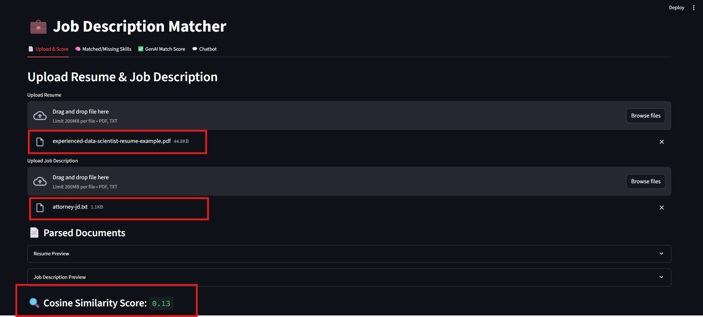
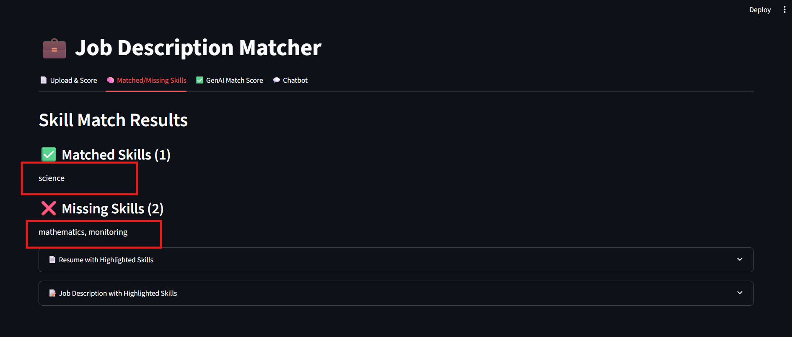
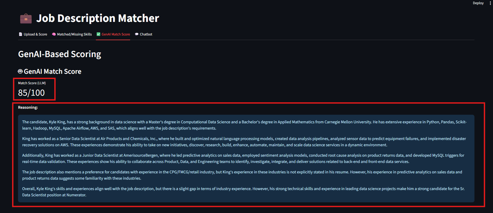
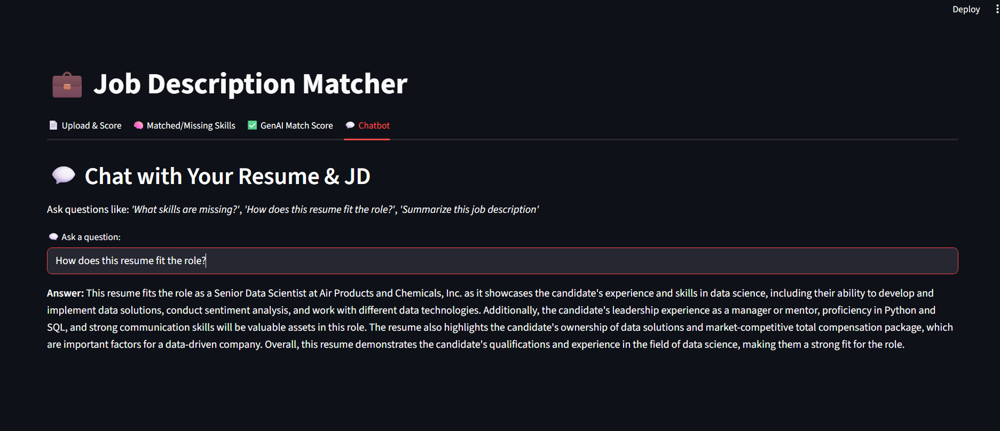

# 🤖 Job Description Matcher (LLM + NLP + GenAI)

An AI-powered web application that compares a resume and job description to:

- Calculate **similarity scores** using embeddings
- Generate a **GenAI reasoning-based score**
- Highlight **matching skills**
- Chat with your resume + job description via **RAG chatbot**

Built with **SentenceTransformers**, **LangChain**, **FAISS**, and **Together AI’s Mistral 7B** — deployed with Streamlit.

---

## 🚀 Features

- 📂 **Upload** Resume (PDF) and Job Description (PDF or text)
- 📏 **Embedding Similarity Score** using `all-MiniLM-L6-v2`
- 🧠 **GenAI Match Score** using Mistral-7B (Together AI API)
- ✨ **Skill Highlighting** (from Excel → JSON skill list)
- 💬 **RAG Chatbot**: Ask questions about your resume and JD
- 🖥 **Interactive UI** with **4 Tabs**:
  1. Upload
  2. Match
  3. GenAI Score
  4. Chat

---

## 📁 Project Structure

```bash

JobDescriptionMatcher/
├── app/
│   ├── main.py                  # Streamlit UI with 4 tabs
├── backend/
│   ├── chatbot_engine.py         # RAG chatbot logic (retrieval + LLM)
│   ├── convert_excel_to_json.py  # Converts skills from Excel to JSON
│   ├── embeddings.py             # Sentence embeddings + cosine similarity
│   ├── genai_scorer.py           # LLM-based reasoning score generator
│   ├── highlight_skills.py       # Highlights skills in text
│   ├── parser.py                 # Resume/JD PDF parsing
│   ├── rag_engine.py             # Text splitters, FAISS vector store, embeddings
│   ├── skill_matcher.py          # Extracts and matches skills from resume/JD
├── data/                         # Example resume & JD PDFs
│   ├── skills_list.json          # Skill list (converted from Excel)
├── .env.example                  # Example env file (no real keys)
├── requirements.txt              # Dependencies
└── README.md                     # You're reading it!

```

---

## 🧠 Tech Stack

- **LLM**: `mistralai/Mistral-7B-Instruct-v0.2` (Together AI API)
- **Embeddings**: `sentence-transformers/all-MiniLM-L6-v2`
- **Vector DB**: FAISS
- **Frameworks**: LangChain, Streamlit
- **PDF Parsing**: PyPDF2, pdfplumber
- **Skill Matching**: Custom JSON + NLP
- **Frontend**: Streamlit
- **Backend**: Python

---

## 📊 Workflow

1. **Upload** Resume & Job Description
2. **Parse** text from PDFs
3. **Compute Embedding Similarity**
4. **Ask LLM** for reasoning-based match score
5. **Highlight Matching Skills**
6. **Chat** with your uploaded documents using RAG

---

## 🚀 Setup & Run

```bash
# 1. Clone repo:
git clone https://github.com/username/JobDescriptionMatcher.git
cd JobDescriptionMatcher

# 2. Install dependencies:
pip install -r requirements.txt

# 3. Set environment variables
# Create .env file and add:
TOGETHER_API_KEY=your_api_key_here

# 4. Run the Streamlit app:
streamlit run app/main.py
Then open http://localhost:8501 in your browser.

```

---

## 📷 Screenshots

1)Tab 1 (Upload Resume & Job Description):

2)Tab 2 (Skill Match Results):

3)Tab 3(GenAI-Based Scoring):

4)Tab 4(💬 Chat with Your Resume & JD):


---

## ⚠️ Limitations

<!-- 📄 PDF Extraction Quality: Scanned/poorly formatted PDFs may affect accuracy -->

📉 Skill Coverage: Depends on skill list provided in skills.json

🧠 LLM Cost & Latency: GenAI scoring requires API calls (cost & time factor)

<!-- 🔒 API Key Security: Must be securely stored in environment variables -->

---

## 🔮 Future Improvements

✅ Multi-label skill category matching

✅ Support for multiple resumes/JDs at once

✅ ATS score calculation

✅ Model fine-tuning for domain-specific matching

✅ User authentication for cloud deployments

---

## 🙋‍♀️ Author

**Hetvi**
📧 [hetvis.pro@gmail.com](mailto:hetvis.pro@gmail.com)
🔗 [LinkedIn](https://www.linkedin.com/in/hetvi-sodha-pro/)
